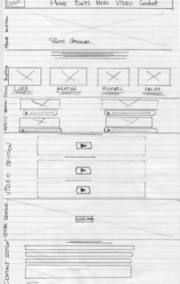
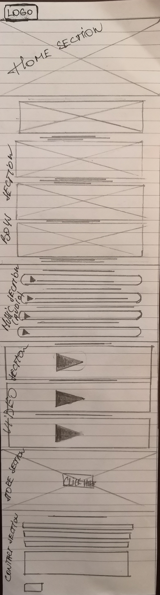

# Milestone Project 1 - 5 SECONDS OF SUMMER
***************************************************************************************************************************************

# Summary
---------------------------------------------------------------------------------------------------------------------------------------
I wanted to build a static front-end website to showcase what I've learned so far.
I am using HTML and CSS to build this website and Bootstrap 4 which is the most popular HTML, CSS, and JavaScript framework for developing responsive, mobile-first websites.
 For this project I've chosen to make an alternative website or fansite for Australian pop/rock band 5 Seconds Of Summer.
 My aim is to keep layout simple, navigation easy to fallow, use clear calls to action, and use catching colours. 
Bands current website doesn’t do them a justice, landing page isn’t aesthetically pleasing and doesn’t encourage to look further, unless you are already an established fan.


# UX
****************************************************************************************************************************************************************
Main objective of this project is to create a website, that is easy to navigate with simple yet streamline page setup.
The aim was to create a fun,bright but functional representation of band's work.
Scrolling through webpage should instantly give clear impression of what it offers to visitor.
Website that is responsive on different screen sizes.
It’s important to have a user-friendly website, for new and existing fans of the band being able to download new songs, buy a tickets and merchandise,
after all website is one of the foundational elements of marketing strategy.
In this case website serves as a meet and greet, pathway to band’s social accounts and their shop and news.
 Design might come across very minimalistic only to focus on what really matters-the art of music.
 This website showcases the band's work- let the music speak!


### User Stories
---------------------------------------------------------------------------------------------------------------------------------------


+	As a fan of the 5SOS, I want to be able to buy band's merchendise and  tickets to their concerts. 
+	As an event organiser, I want to be able to reach out to bands representatives to book them for a private gig.
+	As a fan of the 5SOS, I want to listen to band’s music and be able to buy songs, albums right there and then.
+	As a new visitor to the website, I want to be able look up info about the band on my mobile, while not at my desktop.
+ AS a new visitor to the website, I want to find out more about this band.

### Wireframes
---------------------------------------------------------------------------------------------------------------------------------------
To establish the basic structure of a page before visual design and content is added, I used Wireframe.cc.

Here are the links to the original design,made using the [wireframe.cc](https://wireframe.cc/pro/login.php)

* [Mobile view](https://wireframe.cc/pro/pp/e44ecfde7280627)
* [Desktop view](https://wireframe.cc/pro/pp/29d6b4c9e265965)
 
These are the wireframes after changing the layout to one page scrollable website
 They are hand drawn.

 


# Features

***************************************************************************************************************************************

I felt like my new website needed 6 pages to be transparent and easy to use. All of the pages have the same navigation header and bands social links in the footer.
* Home page- features short introduction to the band and carousel of bands photos.
* Boys page- again short info about each member of the band and their photo. I've used Bootstrap cards for this purpose.
* Music page- has a few audio files.
* Video page-has a few music videos.
* Store page-I used original 5SOS store background and linked it up with the "real"
* Contact page- I've used Bootstrap Form to create a form that anyone can fill in and send it to band.
Although it's possible to fill the form in, it wouldn't send any information entered to the band, because it's not wired up,it's not functional.

**An update**

After going through reviews and suggestions I've redesigned my layout and now my website is single page scrollable website.
I added some changes to suit this kind of layout.

+ Some content is hiddden when watching in mobile view, for example song artwork (image).
+ I added box-shadow class to audio section images to make them stand out a bit and not being so flat.
+ Jumbotron has been remover and added  as "carousel-caption"


# Future features
***************************************************************************************************************************************
Although, there are 5SOS social links featured of the bottom of page, to make things more interesting this website would benefit from:
* Personal social accounts of each band member (probably in "BOYS" page) ,next to their photo.
* More photos added to the "HOME" page carousel.
* Find the audio player setting that stops previous song ,when the other one is selected.
* Validate form in CONTACT page

# Technologies Used
***************************************************************************************************************************************
 
* HTML
* CSS
* [Bootstrap](https://getbootstrap.com/) I've used various components to help me add style and structure to website, e.g. carousel,cards,button, jumbotron,navbar.
* [Hover.css](https://ianlunn.github.io/Hover/)
* [Font Awesome](https://fontawesome.com/) Icons from this website compliments the social links for the boyband.
* [GoogleFonts](https://fonts.google.com/) I imported the font style (Permanent Marker) from this extensive font catalog.
* 

# Testing
***************************************************************************************************************************************

+ I've opened my website link(from GitHub pages) on other laptop to check the look and responsivness and it looked better then on  my own laptop. 

+ I've worked with Google Chrome as my default browser.

+ And I appreaciate the **DevTools** it provided-one of the best features for me is the option of viewing the appearence of the website on diffrent screensizes,
which saves the time to copy the link and open it on different gadgets-mobile, tablet, or desktop every time I make some changes.

+ Carousel photos didn't line up nicely in Edge To fix this problem I resized the photos,but I am aware that there is another way how to fix the poor alignment with stylesheet.
+ I also tested the look and functionality in Firefox browser and everything appears to work there.
+ Mainly I used Git locally for every day checks and tweaks.
+ I ran my documents through **W3C Validator** for automatic syntax check, to see if there is no unnecessary code and discrepancies.

When I sent GitHup pages link via e-mail to my son and he opened it on his tablet, we realized that some of my social media links werent opening properly on some of the pages.
I fixed that, but there is a lesson to learn for future projects-not to create every page separetly,but copy and paste when main page is done (if possible)


### Release notes

 + Audio files are not playing in Opera browser, and what I gathered from Opera forum that Opera only play (HTML5) .ogg files, not mp3. 
I could convert .mp3 files to .ogg files, but at this stage I wouldn't know how to make this work, when different browsers use different types of audio.


#### Going through user stories

* I checked that any visitor to this website can buy the tickets and merchendise by pressing the online store button in STORE page, 
 it opens 5SOS official store website in different browser tab.

* If website visitor wishes to fill in the form to send a message or inquire about something, then it can be done, unfortunalely I havn't learned that in my course yet.
So the form is there and can be filled in, but it's not functional.This is something that can be improved in the future.

* By pressing the social link icons visitor can see and fallow the band on Facebook, Instagram, Twitter and YouTube.
* I didn't add more social platforms to avoid crammed and overwhelming feeling.
* Website visitor can listen to audio files and watch YouTube embeded videos of the 5SOS. Youtube doesn't open in different browser tab,
 which is usefull to keep a visitor "occupied" in this website, rather than get lost in the world of YouTube. Other positive of using YouTube is that visitor can find more 5SOS  videos without leaving the website.

### Bugs 

Some of the Font Awesome icons wouldn't display at all, so I refained from using them. 


# Deployment
************************************************************************************************************************************

I created this website using **AWS Educate Cloud9**
To deploy this website I used **GitHub** which offers free web hosting and it's easy to set up.
After my code was pushed to *GitHub* repository it was ready to be deployed.
To deploy my website I did fallowing:
+ Login to my GitHub accounts
+ Choose sun5lower/Milestone-1-5SOS repository
+ Go to **Settings**
+ There choose **GitHub Pages**
+ Select **Master** branch 
+ Deployed website link is displayed in **GitHub Pages** section
 
 [Click here to see website](https://sun5lower.github.io/Milestone-1-5SOS/)
 
To run this code locally press this link 
+ This will navigate to the main page of the repository.
+ Press **Clone or download**
+ Repository can be cloned using HTTPS or SSH key,so choose one of them and press copy
+ Open **Git Bash**
+ Choose the desired directory
+ Type ```git clone``` and then paste the URL you copied earlier


 ```$ git clone https://github.com/YOUR-USERNAME/YOUR-REPOSITORY```

[Click here to see my repository](https://github.com/sun5lower/Milestone-1-5SOS)

# Credits
***************************************************************************************************************************************
#### In this project I've used:


* [AWS Educate](https://www.awseducate.com/student/s/) this is the editor I've used to code,provided by Code Institute.
* [W3C Validator](https://validator.w3.org/#validate_by_input)
* [Wireframe.cc](https://wireframe.cc/pro/login.php) I used this tool to create a visual representation of a user interface,before any styling and design is added. 
* [W3Schools](https://www.w3schools.com/default.asp) This website helped me understand how to use certain code to achieve  
* [GitHub](https://github.com/) Used to deploy my project
* [YouTube](https://www.youtube.com/) Video files are embeded from YouTube.
* [W3Newbie](https://w3newbie.com/courses/) Help to understand how to implement certain components, with online tutorial.
* [Stack Overflow](https://stackoverflow.com/) Using forums to find out how to make all the photos the same size.
* [Slack](https://slack.com/intl/en-gb/) Reading chats on requiroments and mistakes,asking for advise.
* [htmlcolorcodes](https://htmlcolorcodes.com/color-picker/) I used this website to find right colors for my project-background color, font color etc. 


### Media

The photos used in this site were obtained from:

* [Modest Management](modestmanagement.com)
* [Fanpop](fr.fanpop.com)
* [Pressfrom](Pressfrom.com) by Chris Pizzello 
* [5SOS official website](5SOS.com) - poster for store page and band logo.
* [5sos.fandom](5sos.fandom.com) Michael's profile picture
* me.me Ashton's profile picyure

### Acknowledgements

 Huge thank you to :
   + Narender Singh, my mentor for guiding me, and making me understand the principles of good project.
   + Everyone at Peer-code-review (Slack) for taking their time to comment on my project


## Disclaimer 

My project is for educational purposes only
 
